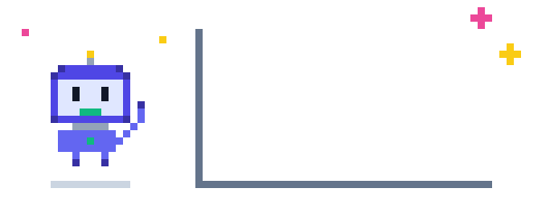

<!-- ░░ HEADER ░░ -->

  

  

  

  
  
  

  

## 🧑‍💻 About Me

  

**Data-driven Product Manager** specializing in AI-native product development through LLM orchestration, agentic workflows, and rapid prototyping. I build with RAG/CAG architectures, MCP integrations, no-code agent frameworks, and statistical models (Random Forest, XGBoost) to drive **measurable** product outcomes — translating complex AI capabilities into business value.

## 🛠️ What I Work On

<table>
  <tr>
    <td width="50%" valign="top">
      <h3>📈 ROI-driven product management</h3>
      Cost-benefit analysis for every AI feature — business impact over technical novelty.
    </td>
    <td width="50%" valign="top">
      <h3>💬 Customer feedback intelligence</h3>
      CSAT, VOC and NPS loops powered by AI for faster insight-to-action cycles.
    </td>
  </tr>
  <tr>
    <td valign="top">
      <h3>📝 Product docs that ship</h3>
      PRDs, BRDs and one-pagers for fintech/SaaS — specs detailed enough that non-coders can build from them.
    </td>
    <td valign="top">
      <h3>⚡ No-code / low-code AI builds</h3>
      Cursor + Claude Code as my IDE — prototyping full-stack products (backend, deployment, analytics) without writing code.
    </td>
  </tr>
  <tr>
    <td valign="top">
      <h3>🔌 MCP-powered workflows</h3>
      Wiring Gmail, Airtable, GitHub and ClickUp together to automate research, docs and cross-functional work.
    </td>
    <td valign="top">
      <h3>🧪 Model selection & evaluation</h3>
      Benchmarking open-source (Llama, Gemma) vs proprietary (GPT-4, Claude) for cost-performance trade-offs.
    </td>
  </tr>
  <tr>
    <td colspan="2" valign="top" align="center">
      <h3>📊 Data-driven product analytics</h3>
      Mixpanel funnels, retention cohorts and feature-usage metrics to validate assumptions and guide the roadmap.
    </td>
  </tr>
</table>

## 🧰 Toolkit

  

  
  
  
  
  
  
  
  
  
  
  

## 📊 GitHub Pulse

  
  

  

## 🐍 Eating My Contributions

  <picture>
    <source media="(prefers-color-scheme: dark)" srcset="https://raw.githubusercontent.com/BhatnagarKashish/BhatnagarKashish/output/github-contribution-grid-snake-dark.gif"/>
    <source media="(prefers-color-scheme: light)" srcset="https://raw.githubusercontent.com/BhatnagarKashish/BhatnagarKashish/output/github-contribution-grid-snake.gif"/>
    
  </picture>

## 🤝 Let's Build Something

  

  

